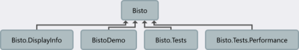
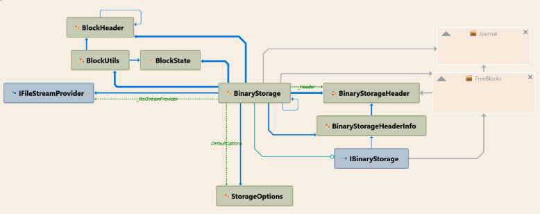

# Bisto BinaryStorage Library

## Table of Contents
- [Overview](#overview)
- [Key Features](#key-features)
- [Installation](#installation)
  - [NuGet Package Manager](#nuget-package-manager)
  - [NET CLI](#net-cli)
  - [PackageReference](#packagereference)
- [Basic Usage](#basic-usage)
- [Usage over Interface](#usage-over-interface)
- [Advanced Usage](#advanced-usage)
  - [Custom Storage Options](#custom-storage-options)
  - [Working with Root Blocks](#working-with-root-blocks)
  - [Handling Inactivity](#handling-inactivity)
- [Architecture](#architecture)
  - [BinaryStorageHeader](#binarystorageheader)
  - [FreeBlocksManager](#freeblocksmanager)
  - [JournalManager](#journalmanager)
  - [BlockUtils](#blockutils)
  - [FileStreamProvider](#filestreamprovider)
- [Performance Considerations](#performance-considerations)
- [Logging](#logging)
- [Error Handling](#error-handling)
- [Disposal](#disposal)
- [API Reference](#api-reference)
  - [IBinaryStorage Interface](#ibinarystorage-interface)
- [Bisto.DisplayInfo Project](#bistodisplayinfo-project)
  - [Overview](#overview-1)
  - [Usage](#usage)
- [Requirements](#requirements)
- [License](#license)
- [Support](#support)
  - [Issue Tracking](#issue-tracking)
  - [Discussions](#discussions)
  - [Documentation](#documentation)
  - [Contributing](#contributing)

## Overview
The **Bisto** BinaryStorage library provides a block-based binary storage system with asynchronous operations for reading, writing, and deleting data.

BinaryStorage is a robust, thread-safe binary storage system designed for efficient data management in C# applications. It provides a flexible and performant solution for storing and retrieving binary data, with features such as free block management, journaling, and automatic stream management.

## Key Features

- **Asynchronous Operations**: All major operations are asynchronous, ensuring optimal performance in multi-threaded environments.
- **Block-based Operations**: Asynchronous read, write, and delete operations for binary data blocks. For different needs, you can choose between compact blocks and rounded blocks.
- **Free Block Management**: Efficiently manages and reuses free blocks to minimize fragmentation and optimize storage usage.
- **Root Block Handling**: Dedicated root block for easy access to important data.
- **Journaling**: Implements a journaling system to ensure data integrity and support recovery in case of unexpected shutdowns.
- **Automatic Stream Management**: Intelligently manages file streams, opening and closing them as needed to conserve system resources.
- **Thread-Safety**: Utilizes semaphores to ensure thread-safe operations for concurrent read and write access.
- **Customizable Storage Options**: Allows configuration of various storage parameters through `StorageOptions`.
- **Logging Integration**: Supports integration with logging framework for comprehensive system monitoring.


## Installation

You can install the `Bisto` BinaryStorage library via NuGet Package Manager or the .NET CLI.

### NuGet Package Manager

```bash
    Install-Package Bisto.BinaryStorage
```

### .NET CLI

```bash
    dotnet add package Bisto.BinaryStorage
```

### PackageReference

```bash
    <PackageReference Include="Bisto.BinaryStorage" Version="1.0.0" />
```

### Basic Usage

1. Create a new BinaryStorage instance:
```csharp
var storage = await BinaryStorage.CreateAsync("mydata.bin", new FileStreamProvider());
```

2. Write data:
```csharp
byte[] data = // ... your data ...
long address = await storage.WriteAsync(data);
```

3. Read data:
```csharp
byte[] retrievedData = await storage.ReadAsync(address);
```

4. Delete data:
```csharp
await storage.DeleteAsync(address);
```
## Usage over interface

Here is an example of how to use the `IBinaryStorage` interface to manage binary data storage:

```csharp
    using Bisto;

    public class Example
    {
        private readonly IBinaryStorage _storage;

        public Example(IBinaryStorage storage)
        {
            _storage = storage;
        }

        public async Task UseStorageAsync()
        {
            // Writing data
            byte[] data = new byte[] { 0x01, 0x02, 0x03 };
            long offset = await _storage.WriteAsync(data);

            // Reading data
            byte[]? readData = await _storage.ReadAsync(offset);

            // Getting block size
            int size = await _storage.ReadDataSizeAsync(offset);

            // Deleting a block
            await _storage.DeleteAsync(offset);

            // get Free block map
            List<(long Offset, int Size)> freeBlocks = await _storage.GetFreeBlockMapAsync();
        }
    }
```
## Advanced Usage

### Custom Storage Options

You can customize the storage behavior by providing `StorageOptions`:

```csharp
var options = new StorageOptions
{
    UseRoundedBlockSize = true,
    EntriesPerBlock = 1000,
    CacheSize = 1024 * 1024, // 1MB cache
    StreamInactivityTimeout = 10 // 10 minutes
};

var storage = await BinaryStorage.CreateAsync("mydata.bin", new FileStreamProvider(), options: options);
```

### Working with Root Blocks

BinaryStorage supports a special root block for storing important data:
```csharp
// Write root block
await storage.WriteRootBlockAsync(rootData);

// Read root block
byte[] rootData = await storage.ReadRootBlockAsync();
```

### Handling Inactivity

The system automatically manages stream resources based on inactivity:
```csharp
// Manually close streams if needed
await storage.CloseStreamIfNeededAsync();
```
## Architecture
There are some projects depends on BinaryStorage: DisplayInfo,Demo,Tests, Performance test.


BinaryStorage is built on several key components:


1. **BinaryStorageHeader**: Manages metadata about the storage file.
   - Stores critical information like file version, root block address, and storage flags.
   - Provides methods to read from and write to the stream, ensuring data consistency.

2. [**FreeBlocksManager**](docu/freeblocksmanager.md): Handles allocation and deallocation of storage blocks.
   - Manages a list of free blocks to optimize space usage.
   - Implements algorithms for efficient block allocation and deallocation.
   - Helps prevent fragmentation and improves overall storage efficiency.

3. [**JournalManager**](docu/journalmanager.md): Provides journaling capabilities for data integrity.
   - Logs operations before they are committed to the main storage.
   - Enables recovery in case of unexpected shutdowns or crashes.
   - Ensures ACID (Atomicity, Consistency, Isolation, Durability) properties for storage operations.

4. **BlockUtils**: Utility methods for working with storage blocks.
   - Provides helper functions for reading and writing block headers.
   - Implements block size calculations and other block-related operations.

5. [**FileStreamProvider**](docu/filestreamprovider.md): Manages file streams for the storage system.
   - Centralizes the creation and management of file streams.
   - Implements lazy initialization of streams to conserve resources.
   - Handles stream disposal and cleanup.

These components work together to provide a robust, efficient, and reliable binary storage system. The BinaryStorage class orchestrates these components, managing concurrent access through semaphores and implementing high-level operations like reading, writing, and deleting data blocks.


The system uses a combination of semaphores for thread synchronization and timers for managing stream inactivity.

## Performance Considerations

- The system is designed for concurrent access, but heavy write operations may impact read performance.
- Proper configuration of `StorageOptions` can significantly affect performance, especially for large datasets.
- The automatic stream management helps in scenarios with intermittent usage patterns.

There are a lot of things I want to optimize or do better, but at the same time I want to share this library quickly.

## Logging

BinaryStorage integrates with Microsoft's `ILoggerFactory` interface. To enable logging:
```csharp
var loggerFactory = LoggerFactory.Create(builder => 
{
    builder.AddConsole();
    // Add other log providers as needed
});

var storage = await BinaryStorage.CreateAsync("mydata.bin", new FileStreamProvider(), loggerFactory: loggerFactory);
```

## Error Handling

The system throws various exceptions for error conditions:

- `DataException`: For data integrity issues.
- `ArgumentNullException`: For null arguments.
- Other standard .NET exceptions as appropriate.

Always wrap operations in try-catch blocks and handle exceptions appropriately.

## Disposal

Proper disposal of BinaryStorage is crucial:

await storage.DisposeAsync();

This ensures all resources, including file streams and semaphores, are properly released.

## API Reference

### `IBinaryStorage` Interface

- `long RootUsedBlock { get; }`  
  Retrieves the address/offset of the root used block.

- `Task DeleteAsync(long dataAddress, CancellationToken cancellationToken = default)`  
  Deletes the block of data located at the specified address asynchronously.

- `Task<List<FreeBlock>> GetFreeBlockMapAsync(CancellationToken cancellationToken = default)`  
  Retrieves a list of free blocks in the storage, with each block's address and size.

- `Task<byte[]?> ReadAsync(long dataAddress, CancellationToken cancellationToken = default)`  
  Reads the data from the specified address asynchronously.

- `Task<int> ReadDataSizeAsync(long dataAddress, CancellationToken cancellationToken = default)`  
  Retrieves the size of the data block located at the specified address.

- `Task<byte[]?> ReadRootBlockAsync(CancellationToken cancellationToken = default)`  
  Reads the root block's data asynchronously.

- `Task<long> WriteAsync(byte[] data, long? existingBlockOffset = null, CancellationToken cancellationToken = default)`  
  Writes data to the storage asynchronously, optionally overwriting an existing block or creating a new one.

- `Task<long> WriteRootBlockAsync(byte[] data, CancellationToken cancellationToken = default)`  
  Writes data to the root block asynchronously.
  
- `BinaryStorageHeaderInfo GetHeaderRo()`  
  Get the storage header as readonly


## Bisto.DisplayInfo Project

### Overview

Bisto.DisplayInfo is an additional project within the Bisto ecosystem, designed to provide utilities for displaying information about Bisto storage files and their associated journals.

### Key Features

1. **Journal Information Display**: 
   - Reads and displays detailed information about journal files, including metadata and entries.
   - Separates and displays committed and uncommitted journal entries.

2. **Storage Information Display**:
   - Reads and displays header information from Bisto storage files.
   - Shows the free block map of the storage.

3. **File Lock Detection**:
   - Includes functionality to check if a file is locked by another process.
   - Can identify and list the processes locking a file.

### Usage
```bash
    Bisto.DisplayInfo.exe my-storage-file.bin
```
This project designed as a diagnostic or administrative tool for Bisto storage systems. It allows users to inspect the contents and state of Bisto storage files and their associated journals, which can be crucial for debugging, monitoring, and maintaining Bisto-based storage solutions.

## Requirements

- **.NET 8.0** or later

## License

This project is licensed under the **GPL License**.

## Support

We're committed to providing robust support for users of our BinaryStorage system. Here are several ways to get help, report issues, or contribute to the project:

### Issue Tracking

- For bug reports, feature requests, or general issues, please use our [GitHub Issues](https://github.com/AlexNek/bisto/issues) page.
- Before creating a new issue, please search existing issues to avoid duplicates.
- When reporting a bug, include as much detail as possible: BinaryStorage version, .NET version, operating system, and a minimal code sample to reproduce the issue.

### Discussions

- For general questions, ideas, or community support, use our [GitHub Discussions](https://github.com/AlexNek/bisto/discussions) forum.
- This is a great place for Q&A, sharing best practices, and discussing potential new features.

### Documentation

- Comprehensive documentation is available in our [GitHub Wiki](https://github.com/AlexNek/bisto/wiki).
- For quick start guides, API references, and advanced usage examples, refer to our [ReadTheDocs page](https://binarystorage.readthedocs.io/).


### Contributing

- We welcome contributions! Please read our [CONTRIBUTING.md](https://github.com/AlexNek/bisto/CONTRIBUTING.md) file for guidelines on how to submit pull requests, report issues, or suggest improvements.


Your feedback and contributions help make BinaryStorage better for everyone!

